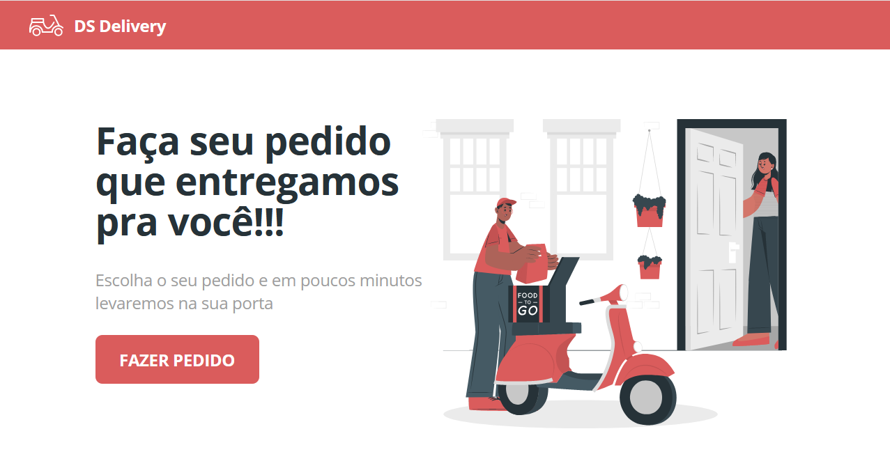

<h1 align="center">DS DELIVER</h1>
<h3 align="center">
  
  
  
  
  
</h3>
<h3>💻 Sobre: </h3>

Projeto desenvolvido na semana DevSuperior. O projeto consiste em uma aplicação de registro e entrega de pedidos.

<h3>🛠 Tecnologias utilizadas: </h3>
<ul>
  <li>Java (JDK 11) </li>
  <li>Spring Framework (STS)</li>
  <li>ReactJs</li>
  <li>React Native</li>
  <li>Expo CLI</li>
  <li>PostgreSQL 12</li>
  <li>Postman</li>
  <li>Heroku</li>
  <li>NodeJs</li>
  
</ul

<h4>Acesse a aplicação rodando no Netlify aqui: -> <a href="https://lenondiedrichsds2.netlify.app">DS Delivery</a></h4>
<h3>📟 Layout da aplicação:</h3>

<h3>⚙️ Instalação: </h3>

    # Clone o repositório
    $ git clone <https://github.com/Lenondiedrich/dsdeliver-sds2>

<h4>Backend</h4>

Utilizando a IDE (Spring Tool Suite), altere o arquivo  `application.properties`, altere o perfil de `prod` para `test`, então execute o arquivo `DsdeliverApplication.java`

<h4>Frontend</h4>

    # Navegue até o diretório front-web
    $ cd front-web

    # Instale as dependências da aplicação
    $ npm install

    # Inicie a aplicação React
    $ npm start

A aplicação irá rodar no endereço `http://localhost:3000/`

<h3>📝 Licença</h3>

Este projeto está sob a licença do MIT

